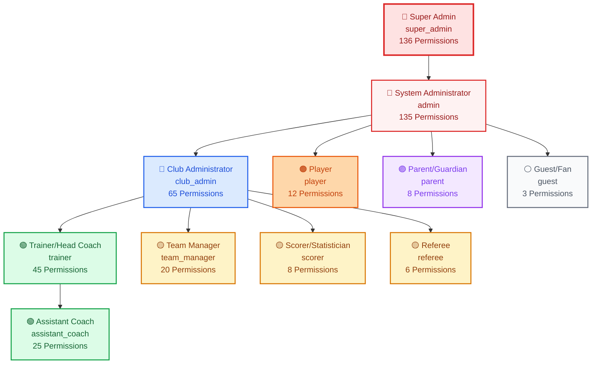
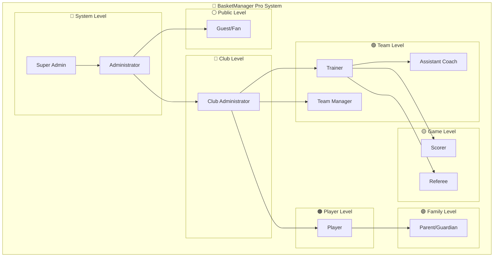
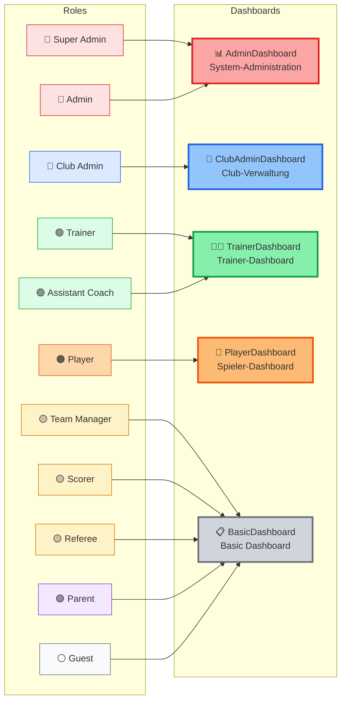
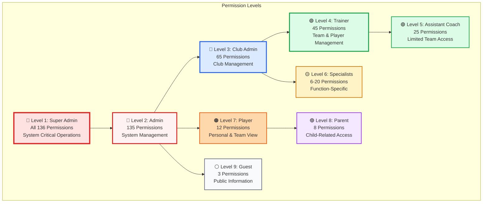
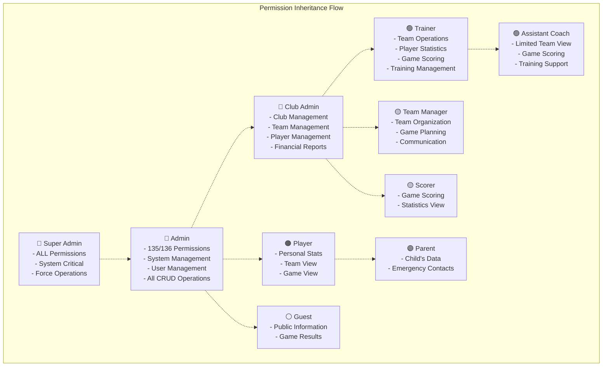

# Rollen-Hierarchie Diagramme - BasketManager Pro

## 🎯 Visuelle Darstellung der Rollen-Struktur

Diese Datei enthält verschiedene Mermaid-Diagramme zur Visualisierung der Rollen-Hierarchie und Beziehungen im BasketManager Pro System.

---

## 📊 Haupthierarchie-Diagramm

---

## 🏢 Organisationsstruktur-Diagramm

---

## 🎛️ Dashboard-Zuordnungs-Diagramm

---

## 🔐 Berechtigungs-Pyramide

---

## 🌐 Datenzugriff-Scope-Diagramm

```mermaid
graph TB
    subgraph "Data Access Scopes"
        subgraph "🌍 Global Access"
            SA2[Super Admin]
            A2[Admin]
        end
        
        subgraph "🏢 Club Scope"
            CA2[Club Admin]
        end
        
        subgraph "👥 Team Scope"
            T2[Trainer]
            AC2[Assistant Coach]
            TM2[Team Manager]
        end
        
        subgraph "🎮 Game Scope"
            S2[Scorer]
            R2[Referee]
        end
        
        subgraph "👤 Personal Scope"
            P2[Player]
            PAR2[Parent]
        end
        
        subgraph "📖 Public Scope"
            G2[Guest]
        end
    end
    
    subgraph "Data Access Rights"
        ALL[All System Data]
        CLUB[Club-specific Data]
        TEAM[Team-specific Data]
        GAME[Game-specific Data]
        PERSONAL[Personal Data Only]
        PUBLIC[Public Data Only]
    end
    
    SA2 --> ALL
    A2 --> ALL
    CA2 --> CLUB
    T2 --> TEAM
    AC2 --> TEAM
    TM2 --> TEAM
    S2 --> GAME
    R2 --> GAME
    P2 --> PERSONAL
    PAR2 --> PERSONAL
    G2 --> PUBLIC
    
    style ALL fill:#fee2e2,stroke:#dc2626,stroke-width:3px
    style CLUB fill:#dbeafe,stroke:#2563eb,stroke-width:2px
    style TEAM fill:#dcfce7,stroke:#16a34a,stroke-width:2px
    style GAME fill:#fef3c7,stroke:#d97706,stroke-width:2px
    style PERSONAL fill:#fed7aa,stroke:#ea580c,stroke-width:2px
    style PUBLIC fill:#f9fafb,stroke:#6b7280,stroke-width:2px
```

---

## 🔄 Permission-Vererbung-Diagramm

---

## 🎨 Legende und Farbschema

### Farb-Codierung

| Farbe | Beschreibung | Hex-Code | Rollen |
|-------|--------------|----------|--------|
| 🔴 **Rot** | System-Administration | `#dc2626` | Super Admin, Admin |
| 🔵 **Blau** | Club-Verwaltung | `#2563eb` | Club Admin |
| 🟢 **Grün** | Trainer-Rollen | `#16a34a` | Trainer, Assistant Coach |
| 🟡 **Gelb** | Spezial-Funktionen | `#d97706` | Team Manager, Scorer, Referee |
| 🟠 **Orange** | Spieler-Rollen | `#ea580c` | Player |
| 🟣 **Lila** | Eltern-Rollen | `#9333ea` | Parent/Guardian |
| ⚪ **Grau** | Gast-Rollen | `#6b7280` | Guest/Fan |

### Icon-Bedeutungen

- 🔴 = Höchste Berechtigungsebene
- 🔵 = Club-spezifische Verwaltung
- 🟢 = Team-fokussierte Rollen
- 🟡 = Funktions-spezifische Rollen
- 🟠 = Spieler-Perspektive
- 🟣 = Familien-Kontext
- ⚪ = Öffentlicher Zugang

---

## 📝 Verwendung der Diagramme

### In Dokumentation
1. **Kopiere den Mermaid-Code** in Markdown-Dokumente
2. **GitHub und GitLab** rendern diese automatisch
3. **VS Code** mit Mermaid-Extension zeigt Live-Preview

### Online-Tools
- [Mermaid Live Editor](https://mermaid.live/)
- [GitHub/GitLab** Markdown-Renderer
- **Notion, Confluence** mit Mermaid-Support

### Export-Optionen
- **SVG** für skalierbare Grafiken
- **PNG** für Präsentationen
- **PDF** für Dokumentation

---

*Letzte Aktualisierung: August 2025*
*BasketManager Pro - Visuelle Rollen-Hierarchie*