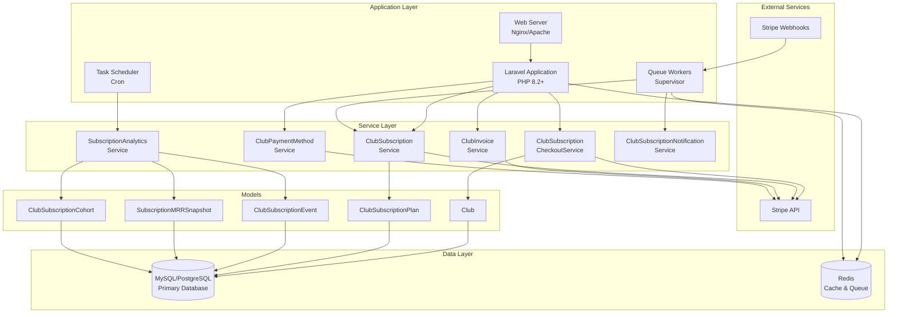
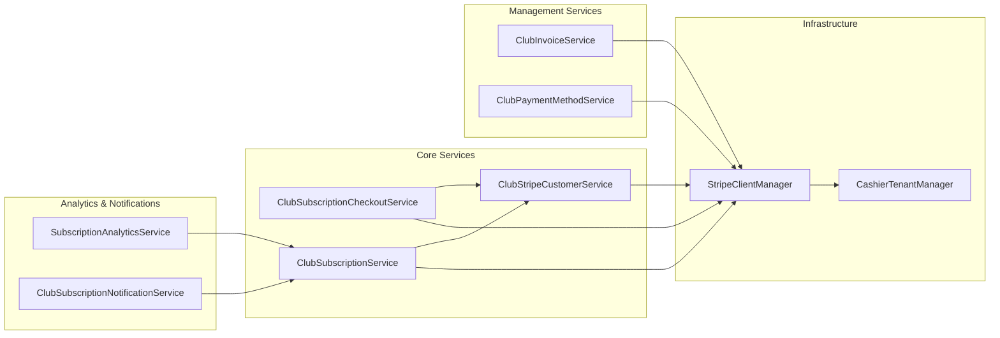
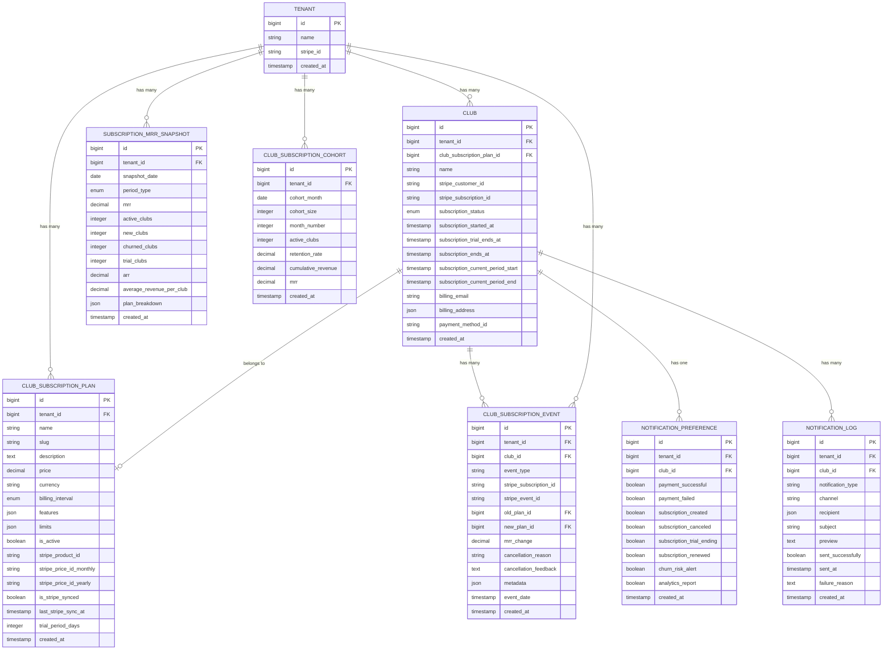
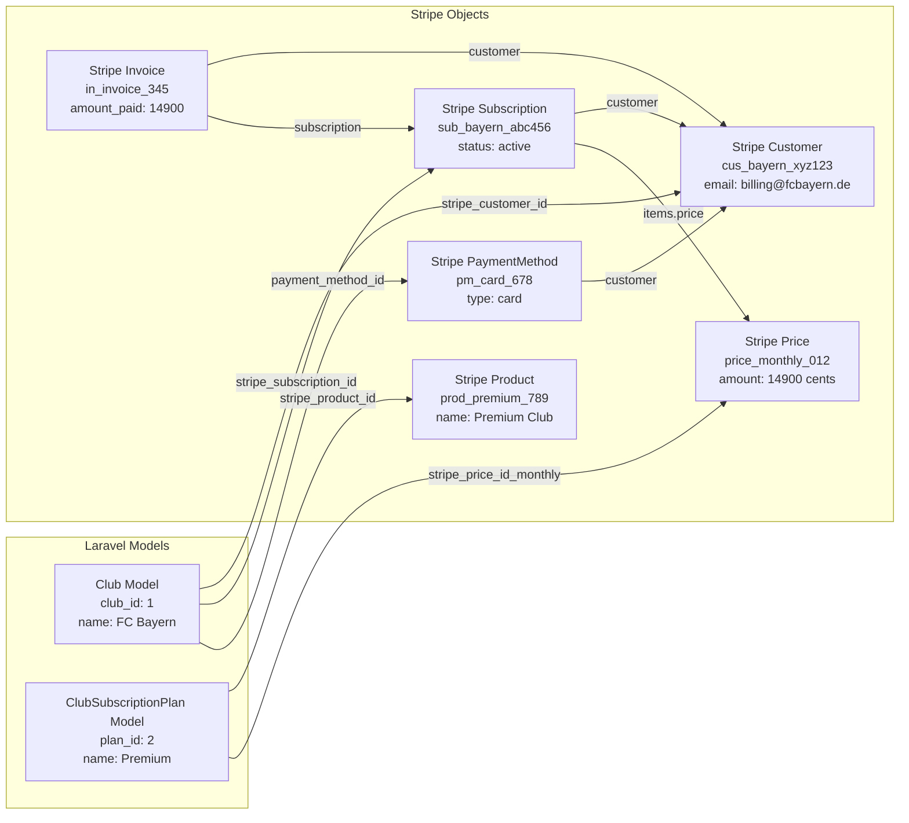
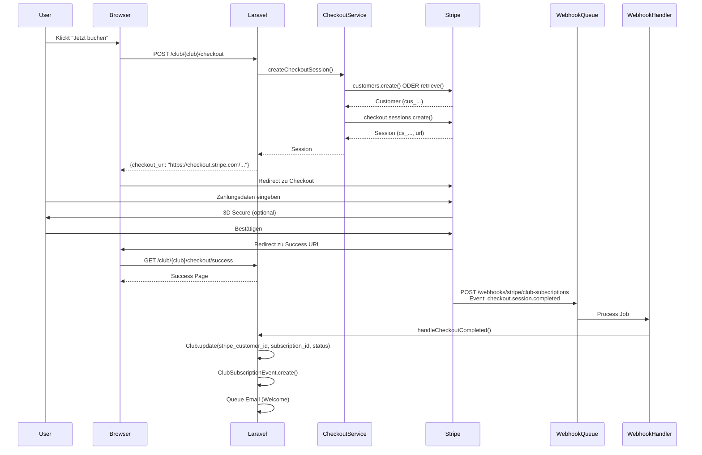
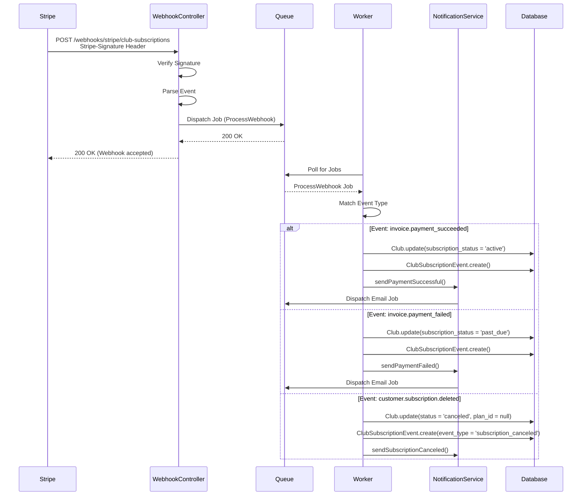
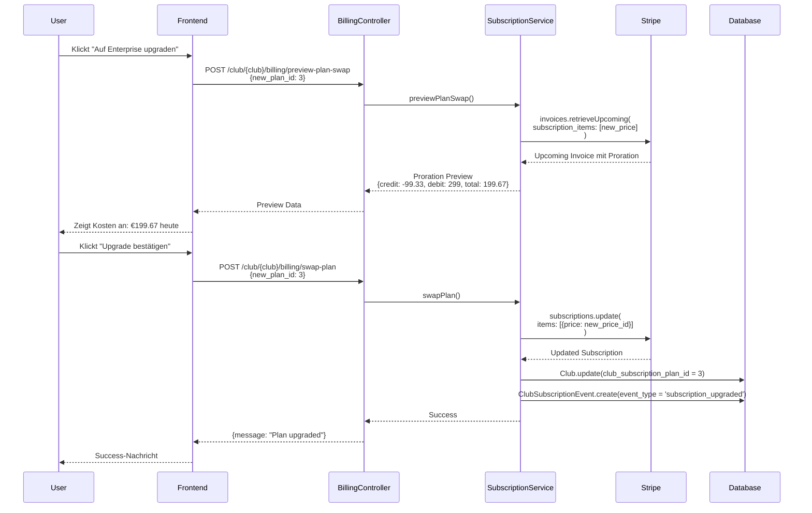
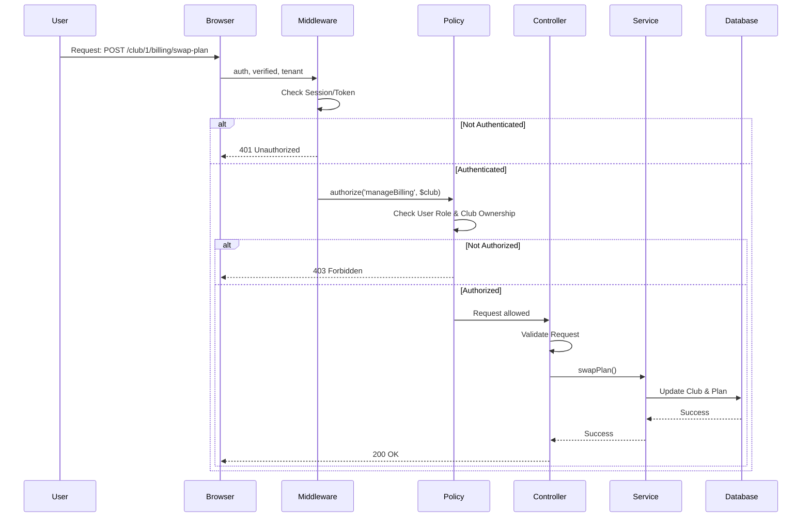

# 🏗️ Club Subscription System - Architektur-Dokumentation

**Version:** 1.0
**Erstellt:** 2025-11-03
**Sprache:** Deutsch
**Zielgruppe:** Software-Architekten, Senior Entwickler, Tech Leads

---

## 📋 Inhaltsverzeichnis

1. [System-Überblick](#system-überblick)
2. [Architektur-Prinzipien](#architektur-prinzipien)
3. [Service-Layer-Architektur](#service-layer-architektur)
4. [Database Schema](#database-schema)
5. [Stripe Object Mapping](#stripe-object-mapping)
6. [Data Flow Diagramme](#data-flow-diagramme)
7. [Feature Gates & Limits](#feature-gates--limits)
8. [Analytics Pipeline](#analytics-pipeline)
9. [Security-Architektur](#security-architektur)
10. [Skalierbarkeit & Performance](#skalierbarkeit--performance)

---

## 🔍 System-Überblick

### High-Level Architektur



### Architektur-Schichten

| Schicht | Komponenten | Verantwortlichkeit |
|---------|-------------|---------------------|
| **Presentation** | Controllers, Inertia.js, Vue Components | HTTP Request Handling, UI Rendering |
| **Application** | Routes, Middleware, Policies | Routing, Authentication, Authorization |
| **Service** | 13 Stripe Services | Business Logic, Stripe API Integration |
| **Domain** | Models, Events | Domain Logic, Data Persistence |
| **Infrastructure** | Database, Redis, Queue | Data Storage, Caching, Job Processing |
| **External** | Stripe API, Webhooks | Payment Processing, Event Notifications |

---

## 🎯 Architektur-Prinzipien

### 1. Separation of Concerns

```php
// ❌ BAD: Controller macht zu viel
class ClubCheckoutController
{
    public function checkout(Request $request, Club $club)
    {
        // Stripe Customer erstellen
        $customer = \Stripe\Customer::create([...]);

        // Checkout Session erstellen
        $session = \Stripe\Checkout\Session::create([...]);

        // DB updaten
        $club->update([...]);

        // Email senden
        Mail::to($club->email)->send(new Welcome($club));
    }
}

// ✅ GOOD: Controller delegiert an Services
class ClubCheckoutController
{
    public function __construct(
        private ClubSubscriptionCheckoutService $checkoutService
    ) {}

    public function checkout(Request $request, Club $club)
    {
        $session = $this->checkoutService->createCheckoutSession($club, $plan);
        return response()->json(['checkout_url' => $session->url]);
    }
}
```

### 2. Dependency Injection

```php
// Services werden via DI injiziert, nicht manuell instantiiert
class ClubBillingController
{
    public function __construct(
        private ClubInvoiceService $invoiceService,
        private ClubPaymentMethodService $paymentMethodService,
        private ClubSubscriptionService $subscriptionService
    ) {}
}
```

### 3. Single Responsibility Principle

Jeder Service hat **EINE** klar definierte Verantwortlichkeit:

| Service | Verantwortlichkeit |
|---------|-------------------|
| `ClubStripeCustomerService` | Stripe Customer Management |
| `ClubSubscriptionCheckoutService` | Checkout Session Creation |
| `ClubSubscriptionService` | Subscription Lifecycle (Cancel, Swap, Sync) |
| `ClubInvoiceService` | Invoice Management |
| `ClubPaymentMethodService` | Payment Method Management |
| `SubscriptionAnalyticsService` | MRR/ARR/Churn Analytics |

### 4. Idempotency

Webhook-Handler sind **idempotent** (mehrfaches Ausführen = gleiches Ergebnis):

```php
protected function handleCheckoutCompleted($session): void
{
    $clubId = $session->metadata->club_id;
    $subscriptionId = $session->subscription;

    $club = Club::find($clubId);

    // Idempotency-Check
    if ($club->stripe_subscription_id === $subscriptionId) {
        return; // Bereits verarbeitet
    }

    // Update nur wenn noch nicht geschehen
    $club->update([
        'stripe_subscription_id' => $subscriptionId,
        'subscription_status' => 'active',
    ]);
}
```

---

## 🏗️ Service-Layer-Architektur

### Service-Dependencies



### Service-Interface-Beispiel

```php
interface ClubSubscriptionServiceInterface
{
    // Plan Management
    public function assignPlanToClub(Club $club, ClubSubscriptionPlan $plan): void;

    // Subscription Lifecycle
    public function cancelSubscription(Club $club, bool $immediately = false): void;
    public function resumeSubscription(Club $club): void;
    public function swapPlan(Club $club, ClubSubscriptionPlan $newPlan, array $options = []): void;

    // Stripe Sync
    public function syncPlanWithStripe(ClubSubscriptionPlan $plan): array;

    // Proration
    public function previewPlanSwap(Club $club, ClubSubscriptionPlan $newPlan, array $options = []): array;
}
```

---

## 💾 Database Schema

### Entity-Relationship Diagram



### Tabellen-Details

#### clubs (Erweitert mit 11 Stripe-Feldern)

| Spalte | Type | Beschreibung |
|--------|------|--------------|
| `stripe_customer_id` | string | Stripe Customer ID (cus_...) |
| `stripe_subscription_id` | string | Stripe Subscription ID (sub_...) |
| `subscription_status` | enum | 'active', 'trial', 'past_due', 'canceled', 'incomplete' |
| `subscription_started_at` | timestamp | Subscription-Startdatum |
| `subscription_trial_ends_at` | timestamp | Trial-Enddatum (wenn Trial) |
| `subscription_ends_at` | timestamp | Subscription-Enddatum (bei Kündigung) |
| `subscription_current_period_start` | timestamp | Aktuelle Abrechnungsperiode Start |
| `subscription_current_period_end` | timestamp | Aktuelle Abrechnungsperiode Ende |
| `billing_email` | string | Billing-Email (kann von Club-Email abweichen) |
| `billing_address` | json | Billing-Adresse (Stripe-Format) |
| `payment_method_id` | string | Default Payment Method ID |

#### club_subscription_plans (Erweitert mit 6 Stripe-Feldern)

| Spalte | Type | Beschreibung |
|--------|------|--------------|
| `stripe_product_id` | string | Stripe Product ID (prod_...) |
| `stripe_price_id_monthly` | string | Stripe Price ID für Monthly (price_...) |
| `stripe_price_id_yearly` | string | Stripe Price ID für Yearly (price_...) |
| `is_stripe_synced` | boolean | Plan ist mit Stripe synchronisiert |
| `last_stripe_sync_at` | timestamp | Letztes Sync-Datum |
| `trial_period_days` | integer | Trial-Periode in Tagen (0 = kein Trial) |

#### club_subscription_events (Analytics-Events)

**Event Types:**
- `subscription_created` - Neue Subscription
- `trial_started` - Trial begonnen
- `trial_ended` - Trial beendet (konvertiert zu Paid)
- `subscription_renewed` - Subscription verlängert
- `subscription_upgraded` - Plan-Upgrade
- `subscription_downgraded` - Plan-Downgrade
- `subscription_canceled` - Subscription gekündigt
- `payment_succeeded` - Zahlung erfolgreich
- `payment_failed` - Zahlung fehlgeschlagen
- `payment_recovered` - Zahlung nach Failed erfolgreich

**Cancellation Reasons:**
- `voluntary` - Freiwillige Kündigung
- `payment_failed` - Zahlungsausfall (involuntary churn)
- `feature_missing` - Fehlende Features
- `too_expensive` - Zu teuer
- `switching_competitor` - Wechsel zu Konkurrenz
- `other` - Andere Gründe

---

## 🔗 Stripe Object Mapping

### Laravel Models ↔ Stripe Objects



### Stripe Webhook Events → Laravel Actions

| Stripe Event | Laravel Action | Betroffene Models |
|--------------|----------------|-------------------|
| `checkout.session.completed` | Club-Status updaten, Event tracken, Welcome-Email | `Club`, `ClubSubscriptionEvent` |
| `customer.subscription.created` | Subscription-Details speichern, Event tracken | `Club`, `ClubSubscriptionEvent` |
| `customer.subscription.updated` | Status & Periode updaten | `Club` |
| `customer.subscription.deleted` | Cancellation tracken, Churn-Event, Email | `Club`, `ClubSubscriptionEvent` |
| `invoice.payment_succeeded` | Status auf 'active', Event tracken, Success-Email | `Club`, `ClubSubscriptionEvent` |
| `invoice.payment_failed` | Status auf 'past_due', Event tracken, Failed-Email | `Club`, `ClubSubscriptionEvent` |
| `payment_method.attached` | Logging | - |
| `payment_method.detached` | payment_method_id clearen | `Club` |

---

## 📊 Data Flow Diagramme

### 1. Checkout-Flow



### 2. Webhook-Event-Processing



### 3. Plan-Swap mit Proration



### 4. Analytics Pipeline

```mermaid
graph TB
    subgraph "Event Collection"
        CheckoutCompleted[Checkout Completed]
        SubscriptionCreated[Subscription Created]
        SubscriptionCanceled[Subscription Canceled]
        PaymentSucceeded[Payment Succeeded]
        PaymentFailed[Payment Failed]
    end

    subgraph "Event Storage"
        ClubSubscriptionEvent[(ClubSubscriptionEvent<br/>Table)]
    end

    subgraph "Scheduled Commands (Cron)"
        MRRDaily[subscription:update-mrr daily<br/>00:00 Uhr]
        MRRMonthly[subscription:update-mrr monthly<br/>1. Tag, 01:00 Uhr]
        ChurnCalc[subscription:calculate-churn<br/>1. Tag, 02:00 Uhr]
        CohortUpdate[subscription:update-cohorts<br/>1. Tag, 03:00 Uhr]
    end

    subgraph "Analytics Tables"
        MRRSnapshot[(SubscriptionMRRSnapshot<br/>Table)]
        CohortTable[(ClubSubscriptionCohort<br/>Table)]
    end

    subgraph "Reporting"
        AnalyticsReport[subscription:analytics-report<br/>1. Tag, 08:00 Uhr]
        Email[Email an Admins]
    end

    CheckoutCompleted --> ClubSubscriptionEvent
    SubscriptionCreated --> ClubSubscriptionEvent
    SubscriptionCanceled --> ClubSubscriptionEvent
    PaymentSucceeded --> ClubSubscriptionEvent
    PaymentFailed --> ClubSubscriptionEvent

    MRRDaily --> ClubSubscriptionEvent
    MRRDaily --> MRRSnapshot

    MRRMonthly --> ClubSubscriptionEvent
    MRRMonthly --> MRRSnapshot

    ChurnCalc --> ClubSubscriptionEvent
    ChurnCalc --> MRRSnapshot

    CohortUpdate --> ClubSubscriptionEvent
    CohortUpdate --> CohortTable

    AnalyticsReport --> MRRSnapshot
    AnalyticsReport --> CohortTable
    AnalyticsReport --> Email
```



---

## 🚪 Feature Gates & Limits

### Hierarchische Feature-Kontrolle

```
TENANT (Enterprise)
├── Features: [live_scoring, advanced_stats, video_analysis]
├── Limits: max_clubs=50, max_teams_per_club=100
│
└── CLUB (Premium)
    ├── Features: [live_scoring, advanced_stats, video_analysis]  ← Muss Subset von Tenant sein
    └── Limits: max_teams=50, max_players=500                     ← Effektiv: min(tenant_limit, club_limit)
```

### Feature-Check-Hierarchie

```php
// app/Services/FeatureGateService.php

public function clubHasFeature(Club $club, string $feature): bool
{
    // 1. Tenant muss Feature haben
    if (!$this->tenantHasFeature($club->tenant, $feature)) {
        return false;
    }

    // 2. Club muss Feature haben (in seinem Plan)
    if (!$club->hasFeature($feature)) {
        return false;
    }

    return true;
}

public function clubCanUseResource(Club $club, string $resource, int $count): bool
{
    // 1. Tenant-Limit prüfen
    $tenantLimit = $club->tenant->getLimit($resource);

    // 2. Club-Limit prüfen
    $clubLimit = $club->getLimit($resource);

    // 3. Effektives Limit = min(tenant_limit, club_limit)
    $effectiveLimit = min($tenantLimit, $clubLimit);

    // 4. Aktuelle Nutzung prüfen
    $currentUsage = $club->getCurrentUsage($resource);

    return ($currentUsage + $count) <= $effectiveLimit;
}
```

### Limit-Enforcement

```php
// Beispiel: Team erstellen mit Limit-Check

public function createTeam(Request $request, Club $club)
{
    // Feature-Check
    if (!$club->hasFeature('team_management')) {
        return response()->json([
            'error' => 'Team-Management nicht verfügbar. Bitte Upgrade durchführen.',
        ], 403);
    }

    // Limit-Check
    if (!$club->canUse('teams', 1)) {
        $limit = $club->getLimit('teams');
        $current = $club->teams()->count();

        return response()->json([
            'error' => "Team-Limit erreicht ({$current}/{$limit}). Bitte Upgrade durchführen.",
        ], 403);
    }

    // Team erstellen
    $team = $club->teams()->create($request->all());

    return response()->json(['team' => $team], 201);
}
```

---

## 📈 Analytics Pipeline

### MRR (Monthly Recurring Revenue) Berechnung

```php
// app/Services/Stripe/SubscriptionAnalyticsService.php

public function calculateDailyMRR(int $tenantId): float
{
    $mrr = 0;

    // Alle aktiven Clubs des Tenants
    $clubs = Club::where('tenant_id', $tenantId)
        ->whereIn('subscription_status', ['active', 'trialing'])
        ->with('subscriptionPlan')
        ->get();

    foreach ($clubs as $club) {
        $plan = $club->subscriptionPlan;
        if (!$plan) continue;

        // MRR normalisieren (auf Monat)
        if ($plan->billing_interval === 'yearly') {
            $mrr += $plan->price / 12;  // Yearly → Monthly
        } else {
            $mrr += $plan->price;  // Already monthly
        }
    }

    return round($mrr, 2);
}
```

### Churn-Rate Berechnung

```php
public function calculateChurnRate(int $tenantId, int $months = 12): float
{
    $startDate = now()->subMonths($months);
    $endDate = now();

    // Clubs zu Beginn der Periode
    $startingClubs = Club::where('tenant_id', $tenantId)
        ->where('subscription_started_at', '<=', $startDate)
        ->count();

    if ($startingClubs === 0) {
        return 0.0;
    }

    // Churned Clubs (gekündigt in der Periode)
    $churnedClubs = ClubSubscriptionEvent::where('tenant_id', $tenantId)
        ->where('event_type', ClubSubscriptionEvent::TYPE_SUBSCRIPTION_CANCELED)
        ->whereBetween('event_date', [$startDate, $endDate])
        ->distinct('club_id')
        ->count();

    // Churn Rate = (Churned / Starting) * 100
    $churnRate = ($churnedClubs / $startingClubs) * 100;

    return round($churnRate, 2);
}
```

### Cohort-Analyse

```php
public function updateCohorts(int $tenantId): void
{
    // Für jeden Cohort-Monat (letzten 24 Monate)
    for ($i = 0; $i < 24; $i++) {
        $cohortMonth = now()->subMonths($i)->startOfMonth();

        // Clubs die in diesem Monat gestartet haben
        $cohortClubs = Club::where('tenant_id', $tenantId)
            ->whereBetween('subscription_started_at', [
                $cohortMonth,
                $cohortMonth->copy()->endOfMonth()
            ])
            ->pluck('id');

        $cohortSize = $cohortClubs->count();
        if ($cohortSize === 0) continue;

        // Für jeden Monat nach Cohort-Start
        for ($month = 0; $month <= $i; $month++) {
            $targetMonth = $cohortMonth->copy()->addMonths($month);

            // Wie viele Clubs sind noch aktiv?
            $activeClubs = Club::whereIn('id', $cohortClubs)
                ->whereIn('subscription_status', ['active', 'trialing'])
                ->where(function ($query) use ($targetMonth) {
                    $query->whereNull('subscription_ends_at')
                        ->orWhere('subscription_ends_at', '>', $targetMonth);
                })
                ->count();

            $retentionRate = ($activeClubs / $cohortSize) * 100;

            // MRR für diesen Cohort in diesem Monat
            $cohortMRR = $this->calculateCohortMRR($cohortClubs, $targetMonth);

            // Speichern
            ClubSubscriptionCohort::updateOrCreate([
                'tenant_id' => $tenantId,
                'cohort_month' => $cohortMonth,
                'month_number' => $month,
            ], [
                'cohort_size' => $cohortSize,
                'active_clubs' => $activeClubs,
                'retention_rate' => round($retentionRate, 2),
                'mrr' => $cohortMRR,
            ]);
        }
    }
}
```

---

## 🔒 Security-Architektur

### Authentication & Authorization Flow



### Row-Level Security (Tenant Isolation)

```php
// app/Models/Club.php

protected static function booted(): void
{
    // Global Scope: Nur Clubs des aktuellen Tenants
    static::addGlobalScope('tenant', function (Builder $builder) {
        if (auth()->check() && auth()->user()->tenant_id) {
            $builder->where('tenant_id', auth()->user()->tenant_id);
        }
    });
}

// Verhindert Cross-Tenant Zugriff
$club = Club::find(1);  // Nur wenn club.tenant_id === auth()->user()->tenant_id
```

### Webhook-Signatur-Validierung

```php
// app/Http/Controllers/Webhooks/ClubSubscriptionWebhookController.php

public function handleWebhook(Request $request): JsonResponse
{
    $payload = $request->getContent();
    $sigHeader = $request->header('Stripe-Signature');
    $webhookSecret = config('stripe.webhooks.signing_secret_club');

    try {
        // Stripe validiert Signatur
        $event = Webhook::constructEvent($payload, $sigHeader, $webhookSecret);
    } catch (SignatureVerificationException $e) {
        // Ungültige Signatur = Rejection
        Log::error('Webhook signature verification failed', [
            'error' => $e->getMessage(),
            'ip' => $request->ip(),
        ]);

        return response()->json(['error' => 'Invalid signature'], 400);
    }

    // Event verarbeiten...
}
```

---

## ⚡ Skalierbarkeit & Performance

### Horizontal Scaling

```
┌─────────────────┐
│  Load Balancer  │
└────────┬────────┘
         │
    ┌────┴────┬────────────┬────────────┐
    │         │            │            │
┌───▼───┐ ┌──▼───┐ ┌──────▼─┐ ┌───────▼─┐
│ App 1 │ │ App 2│ │  App 3 │ │  App N  │
└───┬───┘ └──┬───┘ └────┬───┘ └────┬────┘
    │        │           │          │
    └────────┴───────────┴──────────┘
                  │
            ┌─────▼─────┐
            │  Database │
            │  (Master) │
            └─────┬─────┘
                  │
         ┌────────┴────────┐
         │                 │
    ┌────▼─────┐     ┌────▼─────┐
    │ Read     │     │ Read     │
    │ Replica 1│     │ Replica 2│
    └──────────┘     └──────────┘
```

**Stateless Application:**
- Sessions in Redis (nicht Filesystem)
- File Uploads in S3 (nicht lokal)
- Queue Jobs in Redis (zentral)

### Caching-Strategie

```php
// Club-Subscription-Daten cachen (5 Minuten)
$club = Cache::remember("club:{$clubId}:subscription", 300, function () use ($clubId) {
    return Club::with('subscriptionPlan')->find($clubId);
});

// MRR-Daten cachen (1 Stunde)
$mrr = Cache::remember("tenant:{$tenantId}:mrr", 3600, function () use ($tenantId) {
    return $this->analyticsService->getCurrentMRR($tenantId);
});
```

### Database Indexing

```php
// Migration: Indexes für Performance
Schema::table('clubs', function (Blueprint $table) {
    $table->index('stripe_customer_id');        // Webhook-Lookups
    $table->index('stripe_subscription_id');    // Webhook-Lookups
    $table->index('subscription_status');        // Status-Queries
    $table->index(['tenant_id', 'subscription_status']);  // Composite für Analytics
});

Schema::table('club_subscription_events', function (Blueprint $table) {
    $table->index(['tenant_id', 'event_type']);  // Analytics-Queries
    $table->index(['tenant_id', 'event_date']);  // Time-Range-Queries
    $table->index('club_id');                    // Club-Event-History
});
```

### Queue Optimization

```php
// Webhook-Jobs mit Priority
dispatch(new ProcessStripeWebhook($event))->onQueue('webhooks');

// Email-Jobs mit Lower Priority
dispatch(new SendSubscriptionWelcome($club))->onQueue('emails');

// Supervisor Config: Separate Queues mit unterschiedlichen Worker-Counts
# [program:basketmanager-webhooks]
# command=php artisan queue:work redis --queue=webhooks --sleep=1 --tries=3
# numprocs=8  # Mehr Workers für Webhooks

# [program:basketmanager-emails]
# command=php artisan queue:work redis --queue=emails --sleep=3 --tries=3
# numprocs=2  # Weniger Workers für Emails
```

---

## 📚 Zusammenfassung

### Architektur-Highlights

✅ **Service-orientierte Architektur** mit 13 spezialisierten Services
✅ **Klare Separation of Concerns** zwischen Layers
✅ **Idempotente Webhook-Handler** für zuverlässige Event-Verarbeitung
✅ **Hierarchische Feature-Gates** (Tenant → Club)
✅ **Umfassende Analytics-Pipeline** (MRR, ARR, Churn, Cohorts)
✅ **Row-Level Security** für Multi-Tenancy
✅ **Horizontal Skalierbarkeit** durch Stateless Design
✅ **Performance-optimiert** mit Caching, Indexing, Queue-Prioritization

### Technologie-Stack

| Layer | Technologie |
|-------|-------------|
| **Backend** | Laravel 12, PHP 8.2 |
| **Frontend** | Vue.js 3, Inertia.js, Tailwind CSS |
| **Database** | MySQL 8.0 / PostgreSQL 14 |
| **Cache/Queue** | Redis 7.0 |
| **Payment** | Stripe API v2024-12 |
| **Deployment** | Nginx, Supervisor, Cron |

---

**© 2025 BasketManager Pro** | Version 1.0 | Erstellt: 2025-11-03
